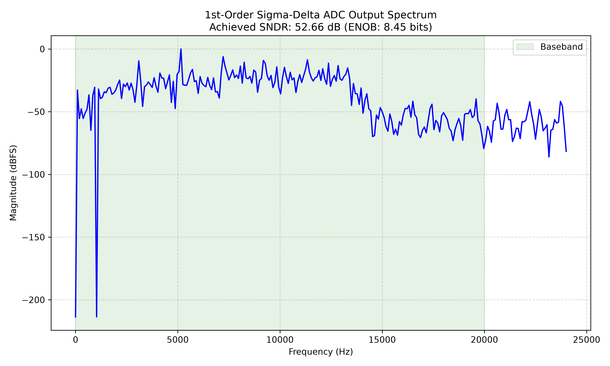

# Mixed-Signal 1st-Order Sigma-Delta ADC


A complete, closed-loop mixed-signal tape-out of a 1st-Order Sigma-Delta Analog-to-Digital Converter. This project bridges the gap between continuous-time analog behavior and discrete-time digital signal processing, featuring a mathematically verified SNR of **52.66 dB**.


*(The final coherent FFT showing the noise-shaping curve and the isolated 1 kHz audio fundamental, achieved through Python-based automated testbench verification.)*

## 📝 Architecture Overview

This architecture converts a continuous analog voltage into a high-fidelity 48 kHz digital audio stream using a high-speed oversampling technique. 

1. **Analog Modulator:** A discrete-time integer behavioral model acting as the continuous-time frontend. It samples the input at a high oversampling ratio (OSR = 64) and quantizes the voltage into a chaotic 1-bit Pulse Density Modulated (PDM) stream at 3.072 MHz.
2. **Cascaded Integrator-Comb (CIC) Filter:** A highly efficient multiplier-less digital decimation filter. It downsamples the 3.072 MHz bitstream by a factor of 64, acting as a low-pass filter to reject out-of-band quantization noise.
3. **FIR Compensator:** A 31-tap transversal Finite Impulse Response filter running at the 48 kHz baseband. It utilizes optimal coefficients generated via the Remez exchange algorithm to correct the high-frequency droop inherent to CIC filters, delivering a pristine 24-bit PCM output.

## ⚙️ Repository Structure

```text
sigma_delta_adc/
├── rtl/                        # Digital Hardware and Analog Wrappers
│   ├── analog_frontend_wrapper.v
│   ├── cic_filter.v
│   ├── fir_filter.v
│   ├── mixed_signal_top.v
│   └── coeffs.hex              # Remez algorithm FIR weights
├── sim/                        # Simulation and Verification
│   └── tb_mixed_signal.py      # cocotb coherent testbench
├── scripts/                    # DSP Coefficient Generation
│   └── generate_fir.py         
├── run_sim.py                  # Python-driven Make script
└── README.md
